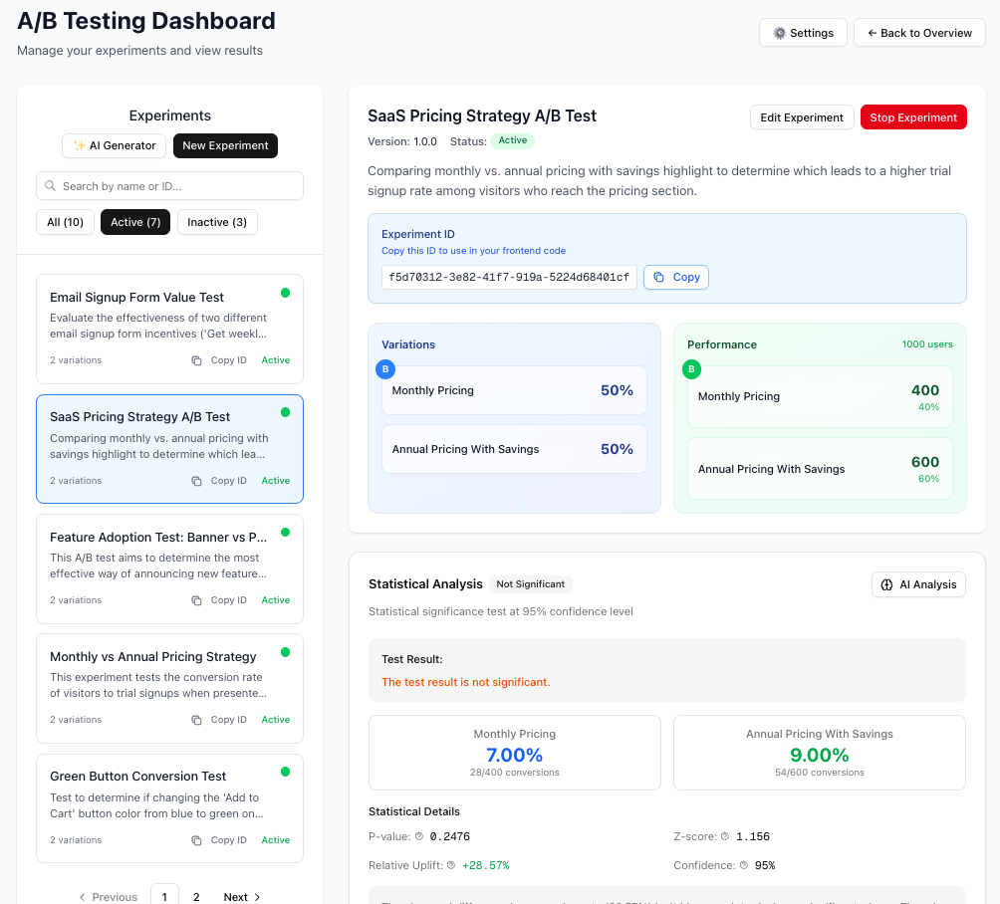

# 🧪 A/B Testing Platform

[](https://www.npmjs.com/package/@denismartins/abtest-sdk)
[](https://opensource.org/licenses/MIT)
[](https://www.typescriptlang.org/)
[](https://nextjs.org/)
[](https://openrouter.ai)

> **A complete, self-hosted A/B testing platform with React SDK, dashboard, statistical analysis, and AI-powered features**

A powerful, open-source A/B testing solution that gives you full control over your experiments. Built with React, TypeScript, and modern web technologies, enhanced with AI (via OpenRouter) for intelligent experiment generation and analysis.



_Beautiful, modern dashboard for managing your experiments_

## 🎯 What You Get

- **📊 Beautiful Dashboard** - Create and manage experiments with an intuitive interface
- **⚡ React SDK** - Easy-to-use hook for frontend integration
- **📈 Statistical Analysis** - Built-in significance testing and performance metrics
- **🤖 AI-Powered Features** - Intelligent experiment generation and statistical analysis
- **🔒 Self-Hosted** - Complete control over your data and infrastructure
- **🚀 Production Ready** - Docker support, API authentication, and more

## 🤖 AI-Powered Features

Powered by [OpenRouter](https://openrouter.ai) - access to multiple AI models with cost optimization and reliability.

### ✨ AI Experiment Generator

Create experiments with natural language descriptions. Simply describe what you want to test, and our AI will generate:

- **Variation suggestions** with proper naming and descriptions
- **Weight distributions** optimized for statistical power
- **Success metrics** tailored to your use case
- **Experiment duration** estimates based on expected traffic

**Example:**

```
"Test different pricing strategies for our SaaS product to optimize conversion rates"
```

→ AI generates a complete experiment with Control vs Treatment variations, proper weights, and conversion tracking.

### 🧠 AI Statistical Analysis

Get intelligent insights from your experiment data:

- **Automated analysis** of statistical significance and confidence levels
- **Business recommendations** on whether to stop, continue, or adjust experiments
- **Performance insights** identifying clear winners and losers
- **Actionable next steps** for implementation and optimization
- **Weight adjustment suggestions** based on performance data

**What it analyzes:**

- Conversion rates and statistical significance
- Sample size adequacy
- Practical vs statistical significance
- Business impact and risk assessment
- Implementation recommendations

### 🔧 AI Configuration

#### Quick Setup

1. **Get OpenRouter API Key** (free credits available)

   - Sign up at [OpenRouter.ai](https://openrouter.ai)
   - Generate an API key from your dashboard

2. **Configure Environment**

   ```bash
   # Add to .env.local
   OPENROUTER_API_KEY=your-api-key-here
   ```

3. **Choose AI Model** (optional)

   ```bash
   # Development (cheap, fast)
   OPENROUTER_MODEL=microsoft/phi-3-mini-128k-instruct

   # Production (balanced)
   OPENROUTER_MODEL=anthropic/claude-3.5-haiku
   ```

#### Cost Optimization

- **Development**: Uses `phi-3-mini` ($0.20/1M tokens) - perfect for testing
- **Production**: Uses `claude-3.5-haiku` ($1.00/1M tokens) - balanced quality/cost
- **Custom**: Override with any OpenRouter model via `OPENROUTER_MODEL`

#### Usage Examples

- **Experiment Generation**: ~$0.001 per experiment created
- **Statistical Analysis**: ~$0.002 per analysis
- **Monthly Usage**: Typically under $5 for moderate usage

## 🚀 Quick Start

### 1. Install the SDK

```bash
npm install @denismartins/abtest-sdk
```

### 2. Clone the Repository

```bash
git clone git@github.com:DenisMSouza/abtest.git
cd abtest
```

### 3. Use in Your React App

```tsx
import { useExperiment } from "@denismartins/abtest-sdk";

function MyComponent() {
  const { variation, trackSuccess } = useExperiment({
    experimentId: "button-color-test",
    userId: "user-123",
    apiKey: "your-api-key",
    apiUrl: "http://localhost:3001/api",
  });

  return (
    <div>
      {variation === "red" ? (
        <button style={{ backgroundColor: "red" }}>Red Button</button>
      ) : (
        <button>Default Button</button>
      )}

      <button onClick={() => trackSuccess()}>Track Conversion</button>
    </div>
  );
}
```

### 4. Set Up the Backend

```bash
# Clone the repository
git clone https://github.com/DenisMSouza/abtest.git
cd abtest

# Start with Docker
docker-compose up -d

# Or run locally
cd backend
npm install
npm start
```

## ✨ Key Features

### 🎨 **Modern Dashboard**

- Create and manage experiments visually
- Real-time performance metrics
- Statistical significance testing
- Experiment ID copying for easy integration

### ⚡ **React SDK**

- Simple `useExperiment` hook
- TypeScript support
- SSR-compatible
- Automatic user assignment
- Conversion tracking

### 📊 **Statistical Analysis**

- P-value calculations
- Confidence intervals
- Relative uplift metrics
- Sample size recommendations

### 🤖 **AI-Powered Intelligence**

- **AI Experiment Generator** - Create experiments with natural language
- **AI Statistical Analysis** - Get intelligent insights and recommendations
- **Smart Weight Optimization** - AI-suggested variation distributions
- **Business Recommendations** - Stop, continue, or adjust experiments based on data
- **Cost-Optimized Models** - Choose between fast/cheap or premium AI models

### 🔒 **Enterprise Security**

- API key authentication
- Request signing
- Self-hosted deployment
- Database-driven configuration

## 📦 NPM Package

The React SDK is available on npm:

```bash
npm install @denismartins/abtest-sdk
```

**Package Details:**

- **Version:** Latest stable release
- **Size:** ~15KB gzipped
- **TypeScript:** Full type definitions included
- **React:** 16.8+ (hooks support)
- **Browser:** Modern browsers (ES2018+)

## 🛠️ Architecture

```
┌─────────────────┐    ┌─────────────────┐    ┌─────────────────┐
│   React App     │    │   Dashboard     │    │   Backend API   │
│                 │    │                 │    │                 │
│  useExperiment  │◄──►│  Create Tests   │◄──►│  Express.js     │
│  Hook           │    │  View Results   │    │  SQLite/MySQL   │
└─────────────────┘    └─────────────────┘    └─────────────────┘
```

## 📚 Documentation

- **[SDK Documentation](sdk/README.md)** - Complete frontend integration guide
- **[Setup Instructions](SETUP.md)** - Backend and dashboard setup
- **[API Documentation](backend/README.md)** - Backend API reference

## 🔗 Repository Information

- **GitHub Repository:** [DenisMSouza/abtest](https://github.com/DenisMSouza/abtest)
- **NPM Package:** [@denismartins/abtest-sdk](https://www.npmjs.com/package/@denismartins/abtest-sdk)
- **Issues & Discussions:** [GitHub Issues](https://github.com/DenisMSouza/abtest/issues)

## 🔧 Backend Integration

### **Success Tracking from Any Backend**

Track success events from your backend when business logic completes (purchases, signups, upgrades, etc.):

#### **Python Example (Django/Flask)**

```python
import requests

class ABTestClient:
    def __init__(self, api_key, api_url="http://localhost:3001/api"):
        self.api_key = api_key
        self.api_url = api_url
        self.session = requests.Session()
        self.session.headers.update({
            "Authorization": f"Bearer {api_key}",
            "Content-Type": "application/json"
        })

    def track_success(self, experiment_id, user_id, event="conversion", value=None):
        """Track success event for experiment"""
        url = f"{self.api_url}/experiments/{experiment_id}/success"

        payload = {
            "userId": user_id,
            "event": event
        }

        if value:
            payload["value"] = value

        try:
            response = self.session.post(url, json=payload)
            response.raise_for_status()
            return response.json()
        except requests.exceptions.RequestException as e:
            print(f"Error tracking success: {e}")
            return None

# Usage in your business logic
client = ABTestClient("abtest_your_api_key_here")

# Track different types of success events
client.track_success("button-color-test", "user_123", "purchase", "premium")
client.track_success("signup-form-test", "user_456", "signup")
client.track_success("pricing-test", "user_789", "upgrade", "pro_plan")
```

#### **Node.js Example**

```javascript
const axios = require("axios");

class ABTestClient {
  constructor(apiKey, apiUrl = "http://localhost:3001/api") {
    this.apiKey = apiKey;
    this.apiUrl = apiUrl;
    this.client = axios.create({
      headers: {
        Authorization: `Bearer ${apiKey}`,
        "Content-Type": "application/json",
      },
    });
  }

  async trackSuccess(experimentId, userId, event = "conversion", value = null) {
    try {
      const response = await this.client.post(
        `${this.apiUrl}/experiments/${experimentId}/success`,
        {
          userId,
          event,
          ...(value && { value }),
        }
      );
      return response.data;
    } catch (error) {
      console.error("Error tracking success:", error.message);
      return null;
    }
  }
}

// Usage
const client = new ABTestClient("abtest_your_api_key_here");
await client.trackSuccess(
  "checkout-flow-test",
  "user_123",
  "purchase",
  "amount_99"
);
```

#### **PHP Example**

```php
<?php
class ABTestClient {
    private $apiKey;
    private $apiUrl;

    public function __construct($apiKey, $apiUrl = 'http://localhost:3001/api') {
        $this->apiKey = $apiKey;
        $this->apiUrl = $apiUrl;
    }

    public function trackSuccess($experimentId, $userId, $event = 'conversion', $value = null) {
        $url = $this->apiUrl . "/experiments/{$experimentId}/success";

        $data = [
            'userId' => $userId,
            'event' => $event
        ];

        if ($value !== null) {
            $data['value'] = $value;
        }

        $options = [
            'http' => [
                'header' => [
                    "Authorization: Bearer {$this->apiKey}",
                    "Content-Type: application/json"
                ],
                'method' => 'POST',
                'content' => json_encode($data)
            ]
        ];

        $context = stream_context_create($options);
        $result = file_get_contents($url, false, $context);

        return $result ? json_decode($result, true) : null;
    }
}

// Usage
$client = new ABTestClient('abtest_your_api_key_here');
$client->trackSuccess('pricing-test', 'user_123', 'upgrade', 'pro_plan');
?>
```

### **Real-World Integration Examples**

#### **E-commerce Purchase Tracking**

```python
# Django view
def process_purchase(request):
    user_id = request.user.id
    amount = request.POST.get('amount')

    # Your business logic
    order = create_order(user_id, amount)

    # Track A/B test success
    abtest_client.track_success(
        experiment_id="checkout-flow-test",
        user_id=str(user_id),
        event="purchase",
        value=f"amount_{amount}"
    )

    return JsonResponse({"success": True, "order_id": order.id})
```

#### **SaaS Signup Tracking**

```javascript
// Express.js route
app.post("/api/signup", async (req, res) => {
  const { email, userId } = req.body;

  // Your business logic
  const user = await createUser(email, userId);

  // Track A/B test success
  await abtestClient.trackSuccess("signup-form-test", userId, "signup");

  res.json({ success: true, user_id: user.id });
});
```

## 🎯 Use Cases

- **E-commerce** - Test checkout flows, product pages, pricing
- **SaaS** - Optimize signup flows, feature adoption, onboarding
- **Content** - A/B test headlines, CTAs, layouts
- **Mobile Apps** - React Native integration support
- **Marketing** - Landing pages, email campaigns, ads

## 🔧 Configuration

### Environment Variables

```bash
# Backend
PORT=3001
NODE_ENV=production

# Frontend
NEXT_PUBLIC_ABTEST_API_URL=http://localhost:3001/api
NEXT_PUBLIC_ABTEST_API_KEY=your-api-key
```

### Docker Deployment

```yaml
version: "3.8"
services:
  abtest-backend:
    build: ./backend
    ports:
      - "3001:3001"
    environment:
      - NODE_ENV=production

  abtest-frontend:
    build: .
    ports:
      - "3000:3000"
    environment:
      - NEXT_PUBLIC_ABTEST_API_URL=http://abtest-backend:3001/api
```

## 🤝 Contributing

We welcome contributions! Please see our [Contributing Guide](CONTRIBUTING.md) for details.

### Development Setup

```bash
# Clone the repository
git clone https://github.com/DenisMSouza/abtest.git
cd abtest

# Install dependencies
npm install

# Start development servers
npm run dev:backend  # Backend on :3001
npm run dev:frontend # Frontend on :3000
```

## 📄 License

This project is licensed under the MIT License - see the [LICENSE](LICENSE) file for details.

## 🙏 Acknowledgments

- Built with [React](https://reactjs.org/)
- Powered by [Next.js](https://nextjs.org/)
- Styled with [Tailwind CSS](https://tailwindcss.com/)
- Icons by [Lucide](https://lucide.dev/)

## 📞 Support

- **Issues:** [GitHub Issues](https://github.com/DenisMSouza/abtest/issues)
- **Discussions:** [GitHub Discussions](https://github.com/DenisMSouza/abtest/discussions)
- **Documentation:** [Full Documentation](https://github.com/DenisMSouza/abtest/wiki)

---

**Made with ❤️ for the developer community**

_Star this repository if you find it useful! ⭐_
